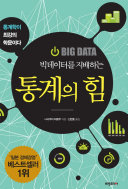
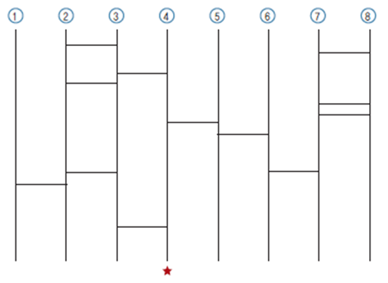
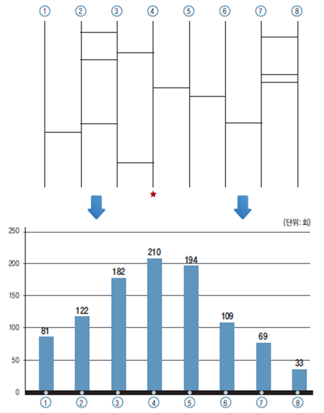

# 빅데이터를 지배하는 통계의 힘<br>-니시우치 히로무-


```
"거듭 말하지만, 10년 이내에 통계 전문가는 가장 섹시한 직업이 될 것이다."
- 할 배리언 박사 -
```

## 사다리 타기

**그림 1:** 사다리 타기 그리기


**그림 2:** 1000번 반복 시뮬레이션 후 당첨 횟수


```
사다리타기 참가자는 모두 4명으로 인원수의 2배수인 8개의 세로선을 긋고 선을 두 번씩 타기로 했다. 별표를 선택한 사람이 당첨자로 책정되며 그는 편의점에 심부름을 다녀와야 한다.
```

사다리타기의 규칙에 따라 번호 찍기를 1000번 반복하고 시뮬레이션을 해보면 당첨 확률이 가장 높은 번호는 별표가 그려진 바로 위의 ④다. ④는 1000번 중 210번에 걸리는 데 당첨 확률이 21.0%에 달한다. 다음으로 ④의 바로 오른쪽인 ⑤가 19.4%의 확률로 당첨되며 맨 오른쪽 끝인 ⑧은 당첨 확률이 3.3%에 불과하다. 하지만 이상하게 사람들이 사다리타기를 하면 양쪽 끝선을 가장 먼저 선택하는 경우가 매우 많다. 사다리타기는 모두가 공평하게 4분의 1, 즉 25% 확률로 당첨될 것이라고 생각한다. 하지만 양쪽 끝의 번호(①과 ⑧)를 선택한 사람이 편의점에 갈 확률은 11.4%밖에 되지 않는다. ④, ⑤를 자주 고르는 사람은 심부름꾼이 될 확률이 40.4%로 올라간다. 그가 사다리타기의 확률을 알지 못한다면 ‘요즘은 왠지 운이 따라주지 않네!’라고 말하며 아까운 시간 심부름을 다녀올 것이다.

=> 확률에 대해 조금이라도 알고 있다면 양쪽 끝의 숫자를 택하는 게 좋다. 확률을 알면 생활이 편해진다.

## 피셔의 밀크티 실험
**로널드 피셔 경(Sir Ronald Fisher)**


## 임의화의 한계
책에 따르면 통계학은 '신속하게 최선의 답을 얻도록 해주는 학문'이며, ‘임의화’는 그중에서도 가장 강력한 무기다. 하지만 이러한 무기에도 3가지의 한계가 있다.
______________________________________
### 현실의 벽:
=> 임의화를 가로막는 ‘현실’의 벽이란 '절대적인 표본 수의 제한'과 '조건 제어 불가능성'이다. ‘단 한번만의 기회’ 혹은 있더라도 겨우 몇 번 정도밖에 기회가 주어지지 않는 일에서는 통계학은 무기력 그 자체이다.
+ ‘NASA에서 우주선을 달에 보낼 때 승무원은 3명이 좋을지 4명이 좋을지를 놓고 갑론을박이 벌어졌을 때’
+ ‘현재 사귀는 애인과 결혼할지 말지 정할 때’
________________________________________
### 윤리의 벽:
=> 임의화가 윤리적 문제를 일으키는 상황이다. 예를 들어, 대지진 시뮬레이션 실험에서 건물 파괴나 인명 피해가 발생할 수 있는 경우는 윤리적 지침에 따라 피해야 한다. 통계학자들은 임의화가 인위적으로 유해한 상황을 만들거나, 불공평한 상황을 유발할 수 있는 경우 이를 금지하는 윤리적 지침을 준수한다.
1. 임의화에 의해 인위적으로 유해한 경우가 생겨서는 안 된다(가능성이 높은 경우도 포함).
+ ‘담배가 폐암이나 심장병 등을 유발하는, 몸에 유해한 것인가?’
2. 유해한 것이 일절 없더라도 '좋다', '나쁘다'처럼 불공평하게 극 대 극 상황이 벌어질 것을 예상할 수 있는 경우도 안 된다.
+ ‘일부 빈곤 가정에만 주택임대비용을 지원해준다.’
________________________________________
### 감정의 벽:
=> 실험 참가자가 임의화에 의해 운명이 결정되는 것을 꺼리는 경우이다. 과학적·윤리적 기준을 충족하더라도 개인 감정이 개입되어 임의화에 저항할 수 있다.
+ ‘아마존닷컴에서 가격산정을 위해 실시한 임의화 비교실험’
