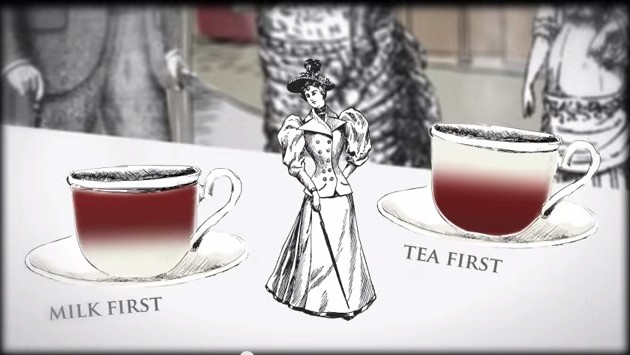

# 빅데이터를 지배하는 통계의 힘<br>-니시우치 히로무-


```
"거듭 말하지만, 10년 이내에 통계 전문가는 가장 섹시한 직업이 될 것이다."
- 할 배리언 박사 -
```

## 사다리 게임

**그림 1:** 사다리 그리기


**그림 2:** 1000번 반복 시뮬레이션 후 당첨 횟수


```
사다리타기 참가자는 모두 4명으로 인원수의 2배수인 8개의 세로선을 긋고 선을 두 번씩 타기로 했다. 별표를 선택한 사람이 당첨자로 책정되며 그는 편의점에 심부름을 다녀와야 한다.
```

사다리타기의 규칙에 따라 번호 찍기를 1000번 반복하고 시뮬레이션을 해보면 당첨 확률이 가장 높은 번호는 별표가 그려진 바로 위의 ④다. **④는 1000번 중 210번에 걸리는 데 당첨 확률이 21.0%에 달한다. 다음으로 ④의 바로 오른쪽인 ⑤가 19.4%의 확률로 당첨되며 맨 오른쪽 끝인 ⑧은 당첨 확률이 3.3%에 불과하다.** 하지만 이상하게 사람들이 사다리타기를 하면 양쪽 끝선을 가장 먼저 선택하는 경우가 거의 없다. 사다리타기는 모두가 공평하게 4분의 1, 즉 25% 확률로 당첨될 것이라고 생각한다. **하지만 양쪽 끝의 번호(①과 ⑧)를 선택한 사람이 편의점에 갈 확률은 11.4%밖에 되지 않는다. ④, ⑤를 자주 고르는 사람은 심부름꾼이 될 확률이 40.4%로 올라간다.**

=> 확률에 대해 조금이라도 알고 있다면 양쪽 끝의 숫자를 택하는 게 좋다. 확률을 알면 생활이 편해진다.


=> 계단의 수가 많으면 사다리 게임은 공평하다. 단, 계단이 300개 이상일 때 '사다리 게임은 공평하지 않다'는 귀무가설을 기각한다.<br>
***출처: https://docs.likejazz.com/ghost-leg-probabilities/***

## 피셔의 밀크티 실험
**로널드 피셔 경(Sir Ronald Fisher)**<br>


```
1920년대 말 영국의 한 부인이 밀크티를 마시면서 '홍차를 먼저 넣고 만든 밀크티'와 '우유를 먼저 넣고 만든 밀크티'를 맛으로 구별할 수 있다고 말했다. 대다수의 사람들이 부인의 말을 웃고 넘겼지만 로널드 피셔는 부인의 설명을 재밌게 여기고 그렇다면 한 번 시험해보고 싶다고 제안했다.
```



**피셔는 부인이 볼 수 없게 한 상태에서 여러 개의 찻잔에 서로 다른 방법으로 탄 밀크티를 준비했다. 이후 부인에게 임의로 차를 마시게 하고 답을 적도록 했다. 이것이 세계 최초로 이루어진 ‘임의화 비교실험’이다.** 눈에서 보이지 않게 밀크티를 만들고 임의로 제시하면 실험에 참가한 사람은 누구도 순서를 예측할 수 없다. 피셔는 부인에게 실험방법을 설명하고 몇 잔의 밀크티를 테스트할 것인지 상세하게 검토한 뒤 부인의 대답 결과와 부인이 우연하게 정답을 맞힐 확률을 계산했다. **부인이 임의로 다섯 잔의 밀크티를 마셨다면 모두 우연히 맞힐 확률은 2의 5제곱분의 1, 즉 32분의 1(약 3.1%)이다. 만약 열 잔을 다 맞췄다면 1024분의 1(약 0.1%)의 확률이다.** 이 정도의 확률을 보였다면 어떤 이유인지는 몰라도 그녀에게 밀크티를 식별하는 능력이 있다고 보는 편이 자연스럽다. 부인은 밀크티를 모두 정확하게 맞췄다.

=> **2003년 영국왕립화학협회가 발표한 ‘한 잔의 완벽한 홍차를 타는 법’**<br>
   홍차를 넣기 전에 우유를 미리 따라놔야 한다. 우유 단백질은 섭씨 75도가 되면 변성되기 때문이다. 만약 우유를 뜨거운 홍차에 따른다면 각각의 우유 알갱이는 우유 결정으로부터 벗어나 확실한 변성이 생기기까지 홍차의 고온에 둘러싸인다. 그러나 뜨거운 홍차를 차가운 우유에 따르면 이런 일이 일어나지 않는다.
______________________________________
### 임의화
- 조건이 평균적으로 동등하거나 아니면 완전히 무작위로 뽑는 것
- 임의화 비교 실험이 강력한 힘을 가졌다고 말하는 가장 큰 이유는 '인간이 제어할 수 있는 그 무엇이라도 인과관계를 분석할 수 있기 때문'

## 임의화의 한계
책에 따르면 통계학은 '신속하게 최선의 답을 얻도록 해주는 학문'이며, ‘임의화’는 그중에서도 가장 강력한 무기다. 하지만 이러한 무기에도 3가지의 한계가 있다.
______________________________________
### 현실의 벽:
=> 임의화를 가로막는 ‘현실’의 벽이란 '절대적인 표본 수의 제한'과 '조건 제어 불가능성'이다. ‘단 한번만의 기회’ 혹은 있더라도 겨우 몇 번 정도밖에 기회가 주어지지 않는 일에서는 통계학은 무기력 그 자체이다.
+ ‘NASA에서 우주선을 달에 보낼 때 승무원은 3명이 좋을지 4명이 좋을지를 놓고 갑론을박이 벌어졌을 때’
+ ‘현재 사귀는 애인과 결혼할지 말지 정할 때’
________________________________________
### 윤리의 벽:
=> 임의화가 윤리적 문제를 일으키는 상황이다. 예를 들어, 대지진 시뮬레이션 실험에서 건물 파괴나 인명 피해가 발생할 수 있는 경우는 윤리적 지침에 따라 피해야 한다. 통계학자들은 임의화가 인위적으로 유해한 상황을 만들거나, 불공평한 상황을 유발할 수 있는 경우 이를 금지하는 윤리적 지침을 준수한다.
1. 임의화에 의해 인위적으로 유해한 경우가 생겨서는 안 된다(가능성이 높은 경우도 포함).
+ ‘담배가 폐암이나 심장병 등을 유발하는, 몸에 유해한 것인가?’
2. 유해한 것이 일절 없더라도 '좋다', '나쁘다'처럼 불공평하게 극 대 극 상황이 벌어질 것을 예상할 수 있는 경우도 안 된다.
+ ‘일부 빈곤 가정에만 주택임대비용을 지원해준다.’
________________________________________
### 감정의 벽:
=> 실험 참가자가 임의화에 의해 운명이 결정되는 것을 꺼리는 경우이다. 과학적·윤리적 기준을 충족하더라도 개인 감정이 개입되어 임의화에 저항할 수 있다.
+ ‘아마존닷컴에서 가격산정을 위해 실시한 임의화 비교실험’
