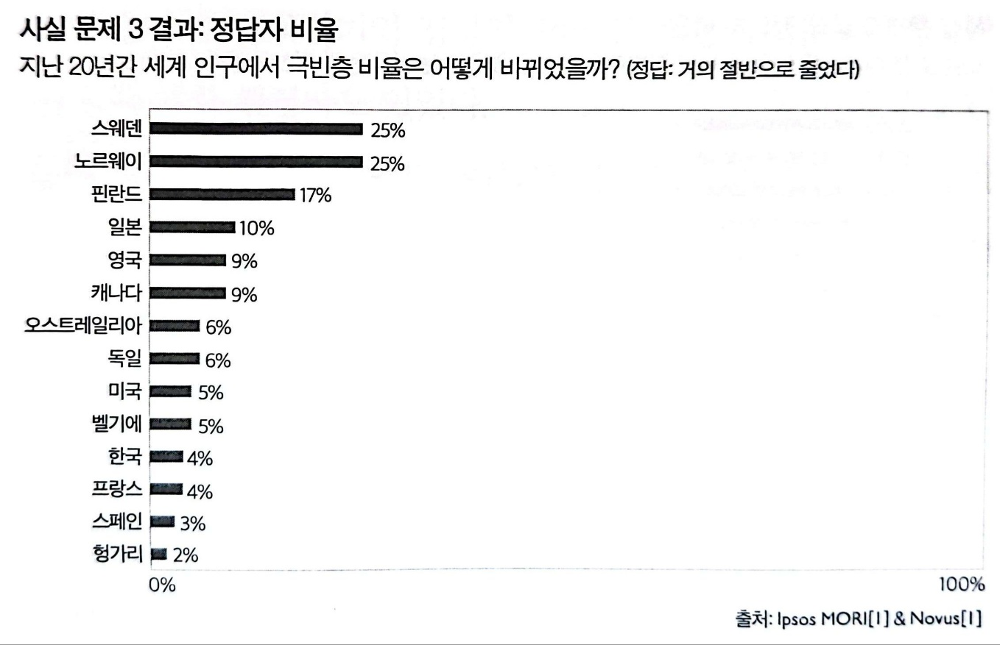
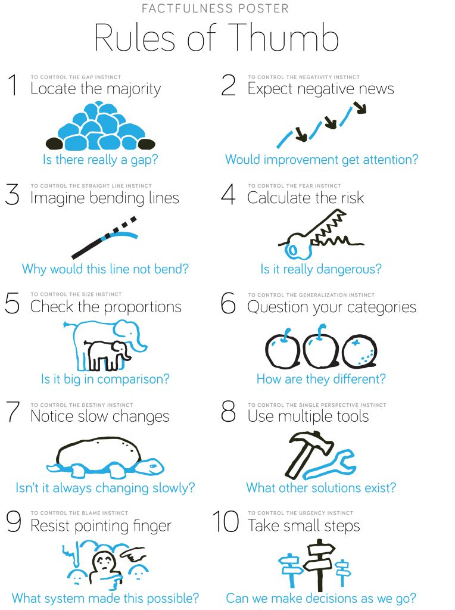
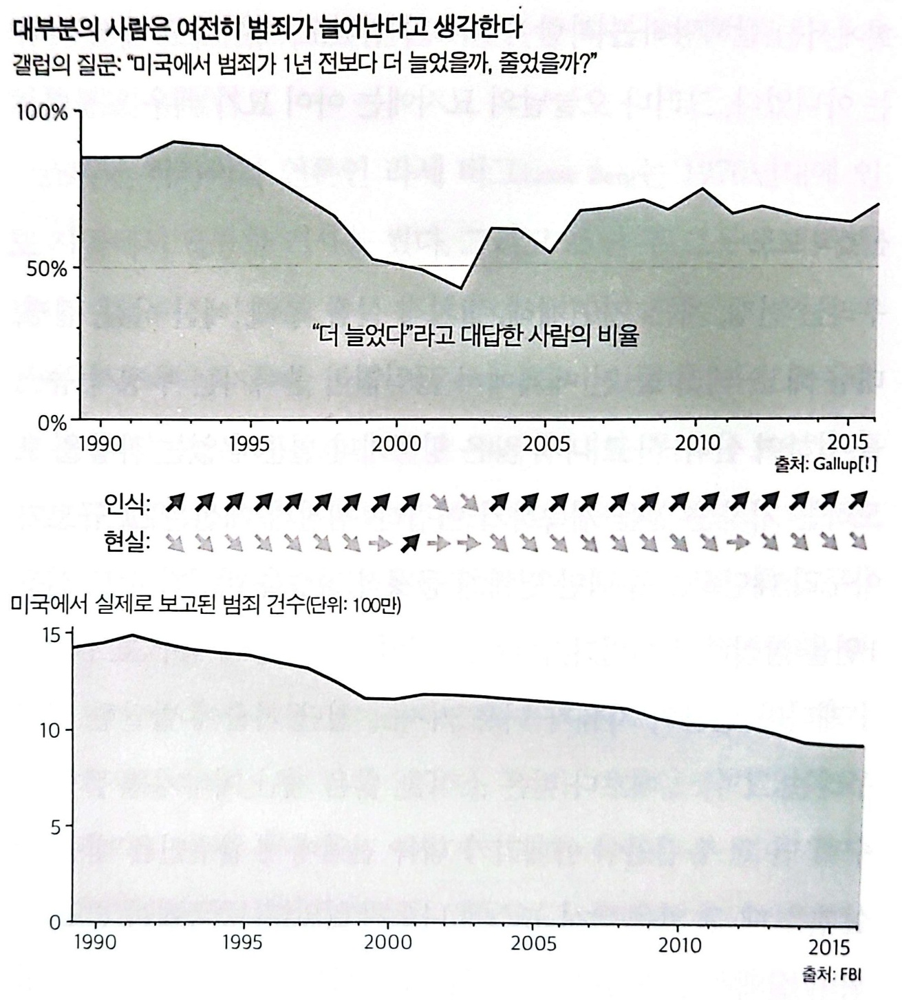
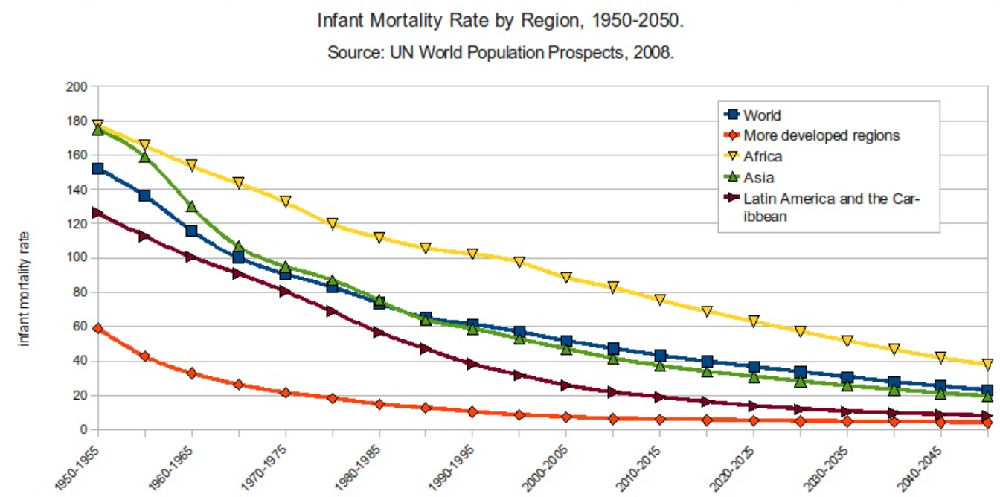
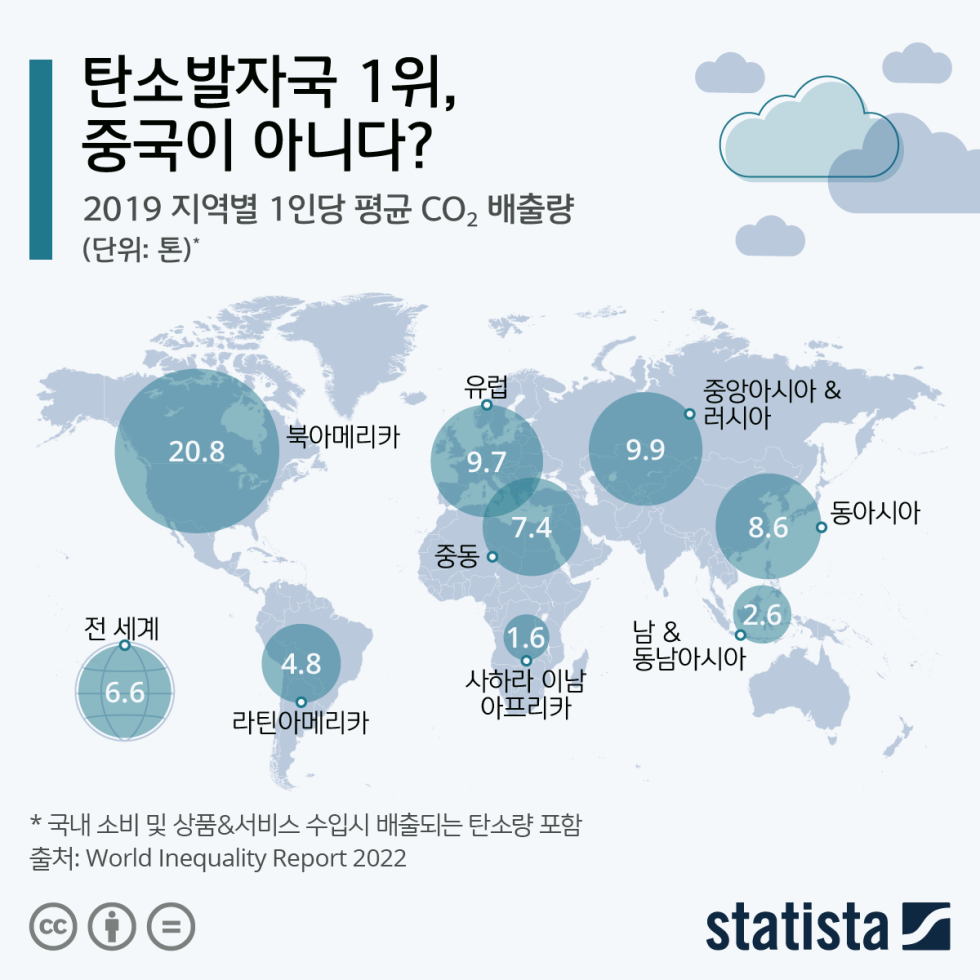

# 팩트풀니스<br>-한스 로슬링-


```
"비합리적 본능에서 벗어나려면 반드시 사실충실성(Factfulness)이 필요하다."
- 한스 로슬링 -
```

## 침팬지보다 팩트에 무지한 인간

```
1. 오늘날 세계 모든 저소득 국가에서 초등학교를 나온 여성은 얼마나 될까?
□ A: 20%
□ B: 40%
□ C: 60%

2. 세계 인구의 다수는 어디에 살까?
□ A: 저소득 국가
□ B: 중간 소득 국가
□ C: 고소득 국가

3. 지난 20년간 세계 인구에서 극빈층 비율은 어떻게 바뀌었을까?
□ A: 거의 2배로 늘었다.
□ B: 거의 같다.
□ C: 거의 절반으로 줄었다.

⋮
```



한스 로슬링은 세계 보건, 교육, 경제 분야의 통계를 바탕으로 13가지 질문을 만들어 실험을 진행하였다. 2017년, 로슬링은 한국을 포함한 14개국에서 1만2천 명을 대상으로 설문조사를 했다. **이 실험에서 13번 문항을 제외한 12개 질문에 대한 정답 평균 개수는 2개였으며, 응답자 중 15%는 0점을 맞았다.**

로슬링이 특히 충격을 받은 점은 노벨상 수상자와 의료계 연구원 등 고학력자들도 형편없는 점수를 기록했다는 것이다. 이는 학력이나 전문지식이 문제가 아니라는 점을 시사한다.

로슬링은 침팬지를 대상으로 한 실제 실험은 하지 않았지만, 가설에 따르면 선입견에 빠져 정답을 피해 가는 인간과 달리 침팬지는 단순 확률로 문제를 맞힐 수 있다. **보기 3개 중 정답을 고를 확률은 33%이며, 이는 평균 4문제 정답으로 인간의 두 배에 해당한다.**

결론적으로, 로슬링은 이 설문에 응한 사람들이 **세상을 실제보다 더 부정적이고 위험하며 희망이 없는 곳으로 인식**하고 있다고 보았다. 이러한 확증 편향으로 인해 사람들이 사실을 인지하지 못한다는 것이다.

## 사람들이 세상을 오해하게 만드는 10가지 본능



1. 간극 본능
2. 부정 본능
3. 직선 본능
4. 공포 본능
5. 크기 본능
6. 일반화 본능
7. 운명 본능
8. 단일 관점 본능
9. 비난 본능
10. 다급함 본능

______________________________________
### 부정 본능

```
좋은 것보다 나쁜 것에 주목하는 성향이다. ... "상황이 점점 나빠진다"는 말은 세상에 관한 이야기 중 내가 많이 듣는 말이다.
```



20세기 이후 통계적으로 보면 합법적 노예제, 아동 사망, 아동 노동, HIV 감염, 재난 사망, 오존층 파괴 등 **부정적인 것들은 감소**했고, 자연보호구역 확대, 여성 투표권 확대, 탈문맹, 작황 증가, 암 생존율 향상, 전기 보급 및 인터넷 사용 등 **긍정적인 것들은 증가**했다. 그럼에도 불구하고 사람들은 세상이 점점 더 나빠진다고 생각하는 경향이 있다. **이는 사람들이 긍정적인 것보다 부정적인 것에 더 집중하는 ‘부정 본능’ 때문이라는 설명이다.**

#### 기억은 대상을 미화한다
=> 예나 지금이나 나이 든 사람은 유년 시절을 미화하면서 세상이 예전 같지 않다고 우긴다. ... 세상은 예전같지 않다. 하지만 예전은 대부분 더 좋았던 게 아니라 더 나빴다. 그럼에도 인간은 옛날의 '진짜 모습'을 너무나 쉽게 잊는다. 

#### 선별적 보도
=> 우리는 전쟁, 기근, 자연재해, 정치적 실패, 부패, 질병, 대량 해고, 테러 등과 같은 부정적인 뉴스가 전 세계에서 끊임없이 쏟아지는 상황 속에서 살아간다. 이러한 상황에서 사고가 나지 않은 비행기 운항이나 개선된 상황 등은 크게 보도되지 않는다. ...

#### 느낌이지 생각이 아니다
=> 많은 사람들은 세상이 점점 나빠지고 있다고 느끼지만, 이는 사실에 기반한 생각이 아닌 단순한 감정이다. 명확한 자료를 제시하더라도 이러한 사람들은 여전히 "느끼기"에는 세상이 나빠지고 있다고 생각할 수 있다. 이는 심각한 문제가 완전히 사라지지 않았기 때문이다. ...

#### 사실충실성
- **나아지지만 나쁘다:** 현 수준과 변화의 방향을 구별하는 연습을 해야 한다. 상황은 나아지는 동시에 나쁠 수도 있다는 확신을 가져야 한다.
- **좋은 소식은 뉴스가 안 된다:** 좋은 소식은 거의 보도하지 않는다. 그래서 뉴스는 거의 항상 나쁜 소식이다. 나쁜 소식을 볼 때면, 같은 정도의 긍정적 소식이었다면 뉴스에 나왔을지 생각해 보아야 한다.
- **점진적 개선은 뉴스가 안 된다:** 점진적으로 개선되는 중에 주기적으로 작은 문제가 나타난다면, 전반적 개선보다 그 문제를 주목할 가능성이 높다.
- **뉴스에 많이 나온다고 해서 고통이 더 큰 것은 아니다:** 나쁜 뉴스가 많이 나오는 이유는 세상이 나빠져서가 아니라, 고통을 감시하는 능력이 좋아지기 떄문일 수 있다.
- **장밋빛 과거를 조심하라:** 사람들은 유년의 경험을, 국가는 자국 역사를 곧잘 미화한다.
______________________________________

### 크기 본능

**사람들은 비율을 왜곡하여 사실을 실제보다 부풀리는 경향이 있다.** 비율을 왜곡하는 것은, 다시 말해 크기를 오판하는 것은 우리 인간의 자연스러운 성향이다. 숫자 하나만 보고 그 중요성을 오판하는 성향도 본능이다.

#### 420만 명의 죽은 아기들



```
언론은 이러한 경향을 더욱 강화하는 역할을 하며, 숫자나 사건, 통계보다는 주어진 사건과 감정적인 이야기에 초점을 맞춘다. ... 2016년에 420만 명의 아기가 죽었다. ... 420만 명은 2016년의 수치다. 그 전해에는 440만 명이었고, 또 그 전해에는 450만 명이었으며, 1950년에는 1440만 명이었다. 오늘날에 비해 해마다 약 1000만 명이 더 죽었다. 
```

#### 1인당 수치



```
"중국, 인도, 그 밖의 신흥 경제국이 위험한 기후변화를 초래할 정도의 속도로 점점 많은 이산화탄소를 배출할 것으로 예상합니다. 실제로 중국은 이미 이산화탄소를 미국보다 많이 배출하고, 인도는 독일보다 많이 배출하고 있습니다." ... 그러나 국가별 총 배출량을 문제 삼는 주장은 나라마다 인구가 크게 다르다는 점을 생각하면 말도 안 된다. 이 논리대로라면 전체 인구가 500만 명인 노르웨이는 1인당 이산화탄소를 아무리 많이 배출해도 문제가 되지 않을 수 있다.
```

#### 사실충실성
- **비교하라:** 큰 수는 항상 커 보인다. 수치가 달랑 하나만 있으면 오판하기 쉬우니 의심해야 한다. 항상 비교하라. 어떤 수로 나눠보면 더없이 좋다.
- **80/20:** 여러 항목을 나열한 긴 목록을 받아본 적이 있는가? 그중 가장 큰 항목 몇 개를 찾아 그것부터 처리하라. 그 몇 개가 나머지를 모두 합친 것보다 더 중요할 가능성이 높다.
- **나눠라:** 총량과 비율은 완전히 다른 이야기다. 비율이 의미가 더 크다. 크기가 다른 집단을 비교할 때는 더욱 그렇다. 특히 국가 간, 지역 간 비교에서는 1인당 수치를 구해보라.