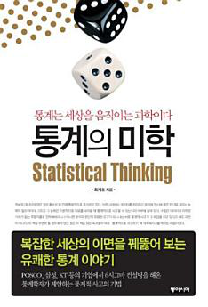
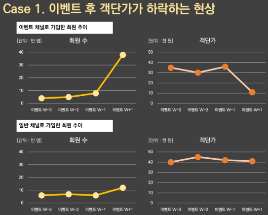
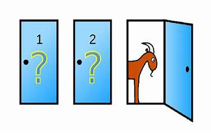
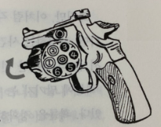

# 통계의 미학<br>-최제호-



```
"국의 간을 맞추기 위해 국 모두를 마실 필요는 없다."
- 최제호 -
```

1. 데이터 수집의 중요성
2. 다양성의 통찰
3. 비교 그리고 관계
4. 예측과 판단

## 하나의 기준으로만 나누면 이상한 결과가 보인다 - 심슨의 패러독스

```
미국에서 일어난 일이다. 어느 대학의 대학원 신입 입학생 자료를 수집한 사람은 아래의 자료를 제시하면서 남녀 간의 합격률 차이가 있으니, 이는 성별에 따른 차별로 시정되어야 한다는 주장을 하였다. 아래 표를 보면 남자와 여자 신입생의 합격률이 각각 52%와 39%로, 차이가 나고 있다. 이를 보면 신입 입학생을 선발하는 데 남녀차별을 했다고 주장하는 것이 충분히 의미 있지 않을까?
```

|           | 불합격자 | 합격자 | 합격률 |
|-----------|----------|--------|--------|
| **남자**  | 1291     | 1400   | 52%    |
| **여자**  | 1113     | 722    | 39%    |

| 분야별 합격률     | A      | B      | C      | D      | E      | F      | 총합   |
|------------------|--------|--------|--------|--------|--------|--------|--------|
| **남자-지원자**  | 825    | 560    | 325    | 417    | 191    | 373    | 2691   |
| **여자-지원자**  | 108    | 25     | 593    | 375    | 393    | 341    | 1835   |
| **남자-합격자**  | 512    | 353    | 120    | 138    | 53     | 224    | 1400   |
| **여자-합격자**  | 89     | 17     | 202    | 131    | 94     | 239    | 772    |
| **남자-합격률**  | 62.1%  | 63.0%  | 36.9%  | 33.1%  | 27.7%  | 60.1%  | 52%    |
| **여자-합격률**  | 82.4%  | 68.0%  | 34.1%  | 34.9%  | 23.9%  | 70.1%  | 39%    |
| **합격률(전체)** | 64%    | 63%    | 35%    | 34%    | 25%    | 65%    |        |

즉, 합격률이 낮은 (남자 여자 차이가 작은) CDE학과는 여성이 많이 지원한 반면(933 vs. 1361), 합격률이 높은 ABF학과는 여성들의 지원이 적다(1758 vs. 474). **즉, 남자들은 각각의 학과에서 여자들에 비해 특별히 합격률이 좋지는 않았다. 오히려 남자의 합격률이 나쁘지만, 합격률이 좋은 학과에(A, B, F) 많은 지원을 하였고, 그 결과 전체 합격률은 좋은 결과를 나타냈다.**

> **남녀 간의 총합격률 차이는 남녀 간의 차별이 아니라, 남녀 간의 학과별 지원 선호도 차이로 인해서 생겼음**<br>
우리가 어느 변수를 기준으로 비교하려 할 때에, 이 변수 이외에 결과에 영향을 주는 결정적인 변수가 있다면, 그것을 고려하여 분석해야 한다는 것이다.

=> **심슨의 역설:** 여러 그룹의 자료를 합했을 때의 결과와 각 그룹을 구분했을 때의 결과가 다른 때




## 상대의 운영 방식을 파악하라 - 몬티 홀 문제



```
1960년대부터 미국에서 방송된 몬티 홀 TV쇼(<거래를 합시다>)에 확률을 이용한 문제가 등장한다. 무대 위에 세 개의 문이 있고 문마다 커튼이 쳐있어서 안을 들여다 볼 수 없다. 감춰진 어떤 문 뒤에는 고급 승용차가 있고, 나머지 2개의 문 뒤에는 줄에 매인 염소가 들어있다. 어느 문 뒤에 고급 승용차가 있는지는 출연자에게 알려주지 않는다. 출연자는 세 개의 문 중 하나를 선택하면, 그 문 뒤에 있는 물건을 가질 수 있다.

예를 들어 출연자가 1번 문을 선택했다고 생각하자. 각각의 문 뒤에 무엇이 있는지 미리 알고 있는 사회자 몬티 홀이 남은 2번, 3번 문 중에서 하나의 문을 열어 보인다(3번이라고 가정하자). 거기에는 염소가 앉아 있다. 그러고서 사회자는 출연자에게 "지금 2번 문으로 선택을 바꾸셔도 됩니다. 바꾸시겠습니까?" 이렇게 묻는다. 이 상황에서 출연자는 과연 어떤 선택을 해야 할까?
```

| 경우 | 고급차가 있는 문 | 사회자가 선택하지 않은 문 | 바꾸지 않은 경우 | 바꿀 경우       |
|------|------------------|---------------------------|------------------|-----------------|
| 1    | 1                | 2 또는 3                 | 당첨             | 꽝             |
| 2    | 2                | 3                         | 꽝             | 당첨 (2번 선택) |
| 3    | 3                | 2                         | 꽝             | 당첨 (3번 선택) |

> **이 문제의 올바른 선택은 '바꾼다'이다.**<br>
다음의 표에서 확인할 수 있듯이 각각의 경우는 1/3의 확률이고, 당신이 최초 선택한 문은 1번이다. 이때 선택을 바꾸면, 1번 문에 고급차가 있는 경우를 제외하고는 고급차를 선택할 수 있다. 경우 1일 확률, 즉 처음에 맞출 확률 1/3을 제외하면 고급차를 가질 수 있다.

| 출연자의 선택 | 바꾼다    | 안 바꾼다       |
|---------------|----------|----------------|
| **당첨**      | 만세!     | 만세!           |
| **미당첨**    | 아이고!!  | "뭐, 할 수 없지." |

=> **나쁜 결과가 나왔을 상황에 대한 걱정을 미리 하기 전에 우선 게임의 구조를 먼저 파악해야 한다.** "우리가 인지해야 할 것은 사물을 생각하는 마음의 법칙이 아니라, 사물을 실제로 지배하는 자연의 법칙이다."


## 죽음을 하늘의 뜻에 맡긴다고? - 러시안 룰렛 게임

```
러시안 룰렛 게임은 여섯 개의 탄창 중 하나에 총알을 넣고 이 탄창을 회전시킨 후 자신의 머리에 총을 겨누고 발사하는 무시무시한 게임이다. 생존 확률은 5/6이다. 이 게임의 구조를 조금 바꾸어서 생각해 보자. 6개의 탄창 중에 총알을 하나가 아니라 연달아 2개를 넣어 생존 확률을 4/6, 즉 2/3으로 낮추고 게임을 시작해보자. 이때, 상대방이 먼저 발사한 후 ‘그대로’ 당신에게 총을 넘겨주었다면 당신은 이 총의 방아쇠를 그대로 당기겠는가? 아니면 다시 회전시킨 후 방아쇠를 당기겠는가? 회전하지 않고 그대로 방아쇠를 당길 경우 생존 확률은 얼마나 될까? 여전히 4/6일까? 아니면 다를까?
```



> 1번과 2번에 탄알이 들어있다. 여기서 상대방이 살아남았다면, 상대방은 3에서 6 중의 하나를 고른 것이다. 그래서 남은 3, 4, 5, 6번은 모두 각각 1/4의 동일한 확률이다. 이때 당신이 총을 받아서 방아쇠를 그대로 당겼다면, 상대방이 6번을 당긴 경우라면 운이 없겠지만, 3에서 5의 경우 생존할 것이다. 그래서 당신의 생존확률은 3/4이다. 이 확률은 탄창을 다시 돌렸을 경우의 확률인 4/6보다 1/12만큼 크다. **그래서 그대로 당기는 것이 유리하다.**

=> 확률을 정확히 계산할 수 있고 당신이 먼저 방아쇠를 당긴다면, 당신은 살아남은 뒤에 총을 그냥 주지 않고, 탄창을 회전한 후에 주는 선택을 할 것이다. **여기서도 마음가짐이 중요한 게 아니라, 구조에 대한 정보가 중요하다.**
