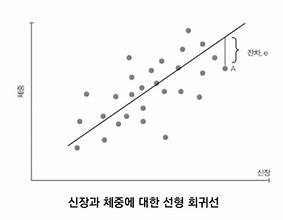

# 벌거벗은 통계<br>-찰스 윌런


```
"세상에는 세 가지 거짓말이 있으니, 첫째는 그냥 거짓말, 둘째는 새빨간 거짓말, 그리고 마지막은 통계다."
- 마크 트웨인 -
```

```
1. 진실, 거짓, 그리고 탐정
2. 메이저리그, 역대 최고의 야구선수는 누구일까?
3. 숫자의 함정, 사실을 왜곡하는 아주 교묘한 거짓말들
4. 넷플릭스는 내가 좋아하는 영화를 어떻게 찾아낼까?
5-1. 보증 기간 연장에 돈 쓰지 말라
5-2. 몬티 홀의 딜레마 염소와 자동차는 어디에 있을까?
7. 쓰레기를 넣으면 쓰레기가 나온다
8. 슈퍼스타, 통계학의 르브론 제임스를 기억하라
9. 왜 교수님은 내가 부정행위를 했다고 생각했을까?
10. 여론을 보다 정확하게 파악하는 방법들
11. 데이터를 분석하는 기적의 만병통치약
12. 명백한 데이터 앞에서도 논리를 잊지 말라
```

## 데이터를 분석하는 기적의 만병통치약

### 업무 스트레스로 죽을 수도 있을까?

그렇다. 과중한 업무 스트레스가 심장병을 유발하여 죽음을 앞당길 수 있다는 점은 부정하기 어려운 사실이다. 하지만 사람을 죽음에 이르게 하는 스트레스는 흔히 생각하는 일반적인 업무 스트레스와는 다르다. 예를 들어, **회사의 운명이 걸린 중대한 결정을 연일 내려야 하는 CEO보다, 지시받은 일을 수행하고 전화 응대에 충실한 비서가 업무 스트레스로 사망할 확률이 훨씬 높다.**

영국 공무원을 대상으로 한 대규모 연구에서도 이러한 연관성이 확인됐다. **연구 결과, 결정권이 낮은 업무와 심혈관계 질환 사이에 의미 있는 연관 관계가 존재했으며, 심장병 발생률이 높은 결정권을 가진 공무원보다 낮은 결정권을 가진 공무원에게서 더 높게 나타났다.** 특히, 가장 위험한 형태의 업무 스트레스는 자신이 맡은 직무에 대한 결정권 부족에서 비롯된다는 점이 밝혀졌다.

다만, 단순히 연관성만을 바탕으로 특정 업무가 건강에 나쁘다는 결론을 내릴 수는 없다. **업무 스트레스를 포함한 환경적 요인들은 복합적인 영향을 미치기 때문에, 단순히 낮은 결정권만으로 결과를 해석하는 데는 한계가 있다.** 연구자들은 더 많은 데이터를 통해 스트레스의 근본 원인을 규명해야 한다고 강조했다.



> **회귀분석** => **다른 변인을 통제한 상태에서** 우리가 알고자 하는 어떤 변수와 결과 사이의 연관관계를 수치로 나타낼 수 있게 해줌

---

### 에스트로겐(여성호르몬의 일종) 요법

회귀분석을 사용할 때 연구할 때 명심해야 할 점이 아무도 죽이면 안 된다는 것이다. ... 아주 똑똑한 사람들조차 무심코 이 법칙을 어길 때가 있기 때문이다.

**1990년대 초 의료 기관들은 심장병, 골다공증 등 폐경에 따른 질환을 예방하기 위해 폐경기 여성에게 에스트로겐을 투여해야 한다고 입을 모았다.** 2001년 건강에 도움이 된다는 믿음으로 에스트로겐을 처방받은 여성은 약 1,500만 명에 달했다.

왜 그런 믿음이 생긴걸까? 당시 (회귀분석을 사용한) 연구들이 에스트로겐을 보충했을 때 의학적 효과가 있다고 주장했기 때문이다. **더 정확하게 표현하자면 여성 12.2만 명을 대상으로 한 장기간의 연구에서 에스트로겐 투약과 심장마비 간에 음의 상관관계가 나타났기 때문이다.** 이 연구에 따르면 에스트로겐을 투여 받고 있는 여성의 심장마비 발생 횟수는 그렇지 않은 여성의 1/3 수준이었다. ... 이 연구의 주체는 하버드 의과대학과 하버드 공공보건학과였다. ...

**임상시험 결과, 심장마비, 뇌졸중, 혈전증, 유방암 등 건강문제를 일으키는 횟수가 에스트로겐을 투여받은 여성들에게서 더 많은 것으로 나타났다.** 에스트로겐 보충 요법은 효과도 있었지만 그보다 에스트로겐 보충으로 인한 위험이 더 컸다. ...


- **비선형 관계를 분석하는 데 선형 회귀분석을 사용한 경우:**<br> 변수 간의 관계가 단순히 직선으로 표현되지 않는데 일부 선형 관계가 측정된 부분을 전체로 확대 해석한 경우

> (1) 올바른 회귀방정식을 세우는 과정이 통계적 계산 과정보다 더 중요하다.<br>
(2) 대다수 통계적 추론에서와 마찬가지로 회귀분석은 특정 상황에 기반한 분석이다.
>
> => **"기적의 만병통치약도 복용법을 지키지 않으면 듣지 않는 법이다."**

## 